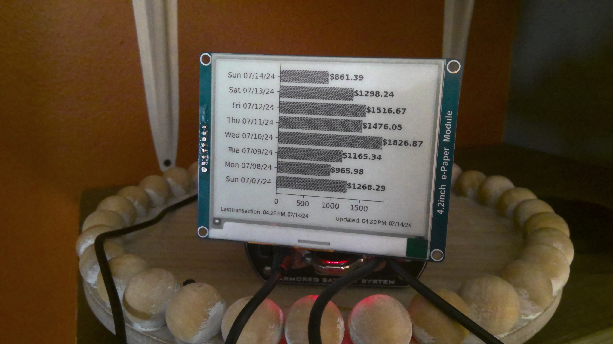

# SalesDashboard
Tired of logging into Square and refreshing every so often to get your updated daily sales? So was I, so it became my excuse to use my e-ink display for something different than a standard weather station.

Actual hardware (case) coming soon.

## Execution
1. Create a new application in your Square store. You will need a production access token to retrieve your transaction data.
2. Connect your Raspberry Pi to your Waveshare 4.2 v2 400x300 e-ink display (will work with their other sizes but will need adjustment in the code for resolution differences).
3. Clone this repository in your home directory on your Raspberry Pi: `git clone https://github.com/maddocker/SalesDashboard.git`
4. Export your access token to a new environment variable titled `SQUARE_ACCESS_TOKEN`.
5. Enter new directory: `cd SalesDashboard/`
6. Create a virtual environment for this package: `python -m venv .venv`
7. Activate the virtual environment: `source .venv/bin/activate`
8. Install this package into the virtual environment: `pip install --upgrade -e .`
9. Run (when virtual environment activated) with: `home-dashboard`
10. Add cron job; example below. A standard installation of Raspberry Pi OS ships with a cron application that can export environment variables directly.

## Automation
Example cron job (`crontab -e`):
```
SQUARE_ACCESS_TOKEN={{token here}}
# m h  dom mon dow   command
*/10 * * * * /home/maddocker/SalesDashboard/.venv/bin/python /home/maddocker/SalesDashboard/src/home_dashboard/home_dashboard.py
```

## Other Notes
- The code expects you to be in the Central timezone. Changing this should be fairly minimal if you are elsewhere.
- The `rpi-lgpio` was a last-minute addition because I ended up using my new Raspberry Pi 5 for this instead of the Zero 2W--take it from me and keep those pin headers around even if you don't have a use for them at the moment. This package is a requirement because the 5 apparently uses different hardware for the GPIO. I am not currently sure if this package being installed will conflict with other RP models, but you may have to remove that line if so. I plan on testing this once I have another Pi to test.