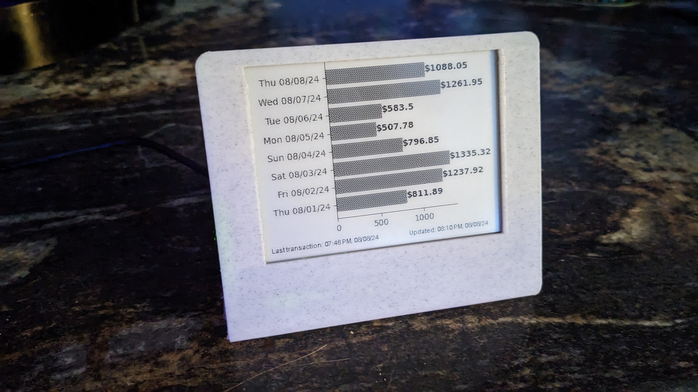
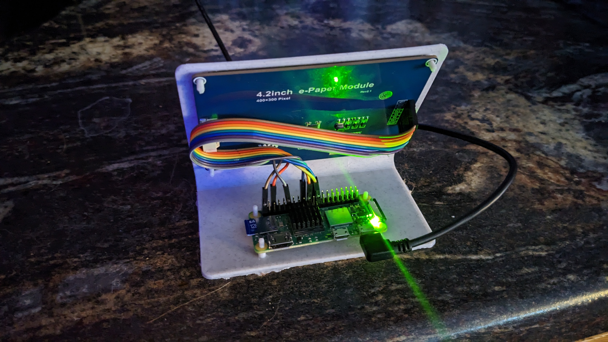

# SalesDashboard
Tired of logging into Square and refreshing every so often to get your updated daily sales? So was I, so it became my excuse to use my e-ink display for something different than a standard weather station.




## Execution
1. Create a new application in your Square store. You will need a production access token to retrieve your transaction data.
2. Connect your Raspberry Pi to your Waveshare 4.2 v2 400x300 e-ink display (will work with their other sizes but will need adjustment in the code for resolution differences).
3. Clone this repository in your home directory on your Raspberry Pi: `git clone https://github.com/maddocker/SalesDashboard.git`
4. Export your access token to a new environment variable titled `SQUARE_ACCESS_TOKEN`.
5. Enter new directory: `cd SalesDashboard/`
6. Create a virtual environment for this package: `python -m venv .venv`
7. Activate the virtual environment: `source .venv/bin/activate`
8. Install this package into the virtual environment: `pip install --upgrade -e .`
9. Run (when virtual environment activated) with: `home-dashboard`
10. Add cron job; example below. A standard installation of Raspberry Pi OS ships with a cron application that can export environment variables directly.

## Automation
Example cron job (`crontab -e`):
```
SQUARE_ACCESS_TOKEN={{token here}}
# m h  dom mon dow   command
*/10 * * * * /home/maddocker/SalesDashboard/.venv/bin/python /home/maddocker/SalesDashboard/src/home_dashboard/home_dashboard.py
```

## Other Notes
- The display stand printed fine for me with tree supports and 40% infill. The Pi and the display took a small amount of force to clear the guides, but are now in place enough that I didn't feel the need to have any other retention method. Your printer's tolerance may differ.
- If/when there are issues where the display does not go through a full cycle and shut down properly (such as a power outage or unplugging the unit to move somewhere else), the display may stop responding appropriately. So far, the best method I have found to correct this is to power down the Pi, unplug its power supply, and unplug the display cable connector on the back of the display. After a few seconds, restart in the reverse order. The display should now be working as expected.